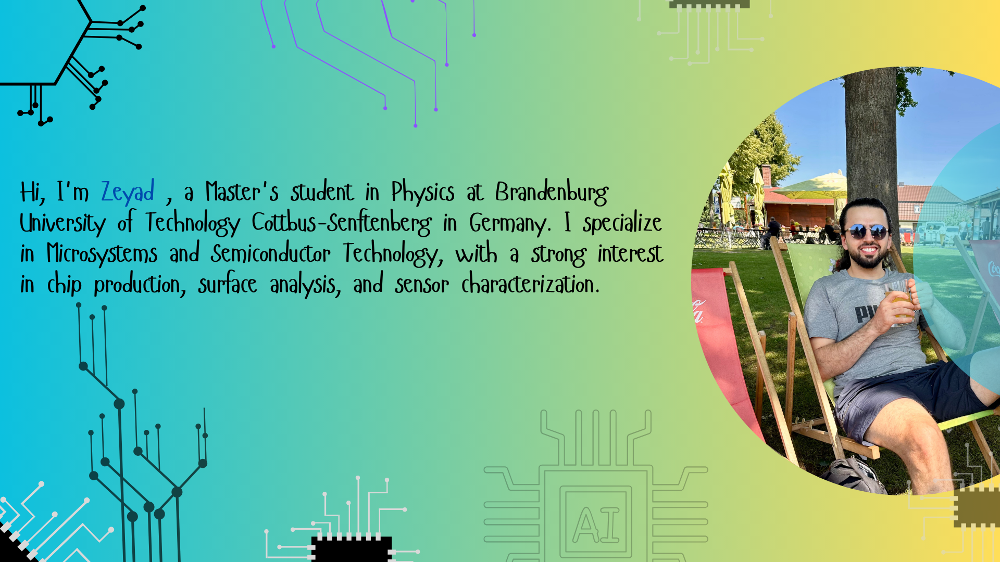
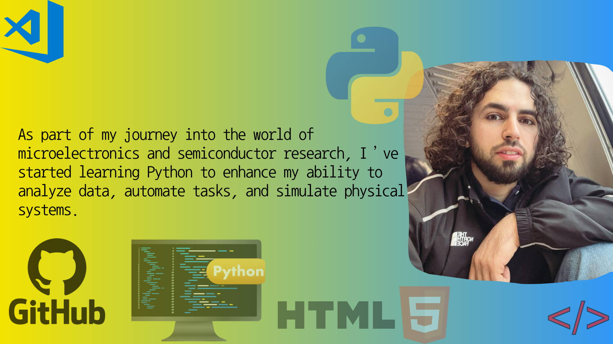

# Hi, I'm Zeyad 👋

 Master's student in Physics at BTU Cottbus-Senftenberg  
 Focus: Microsystems, semiconductor devices, and spectroscopic analysis  
 Currently learning Python and contributing to open-source  
 Interested in MEMS, chip production, and research  
 

 Languages: Kurdish [native], English [C1], German [B2], Arabic [B2]

###  Current Goals
- Improve Python and coding skills
- Get a working student job in chip production

###  Contact Me
- 📧 Email: Zeyad.uni@gmail.com
- 📞 Phone: +49 174 6597835
  
